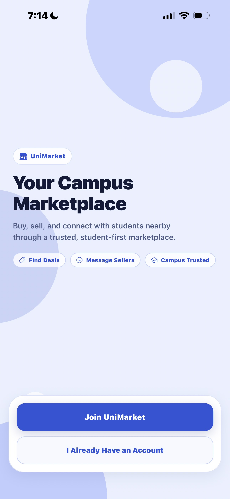
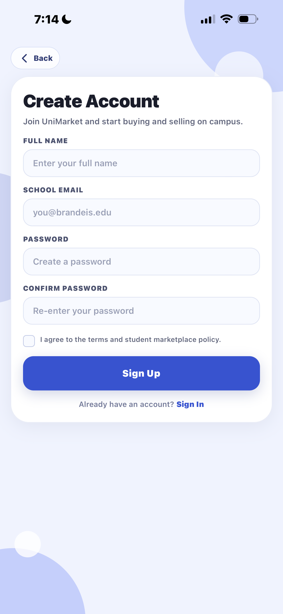
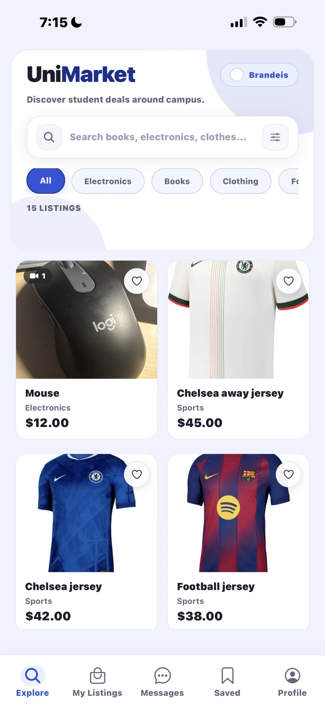
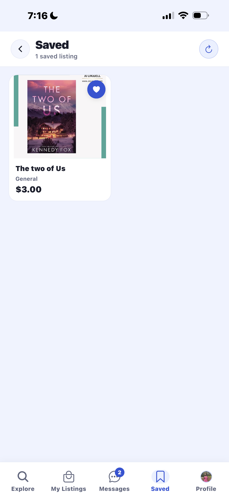
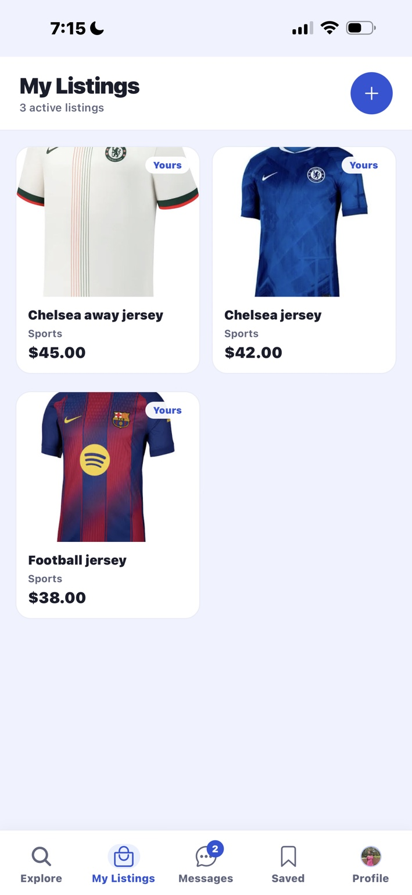
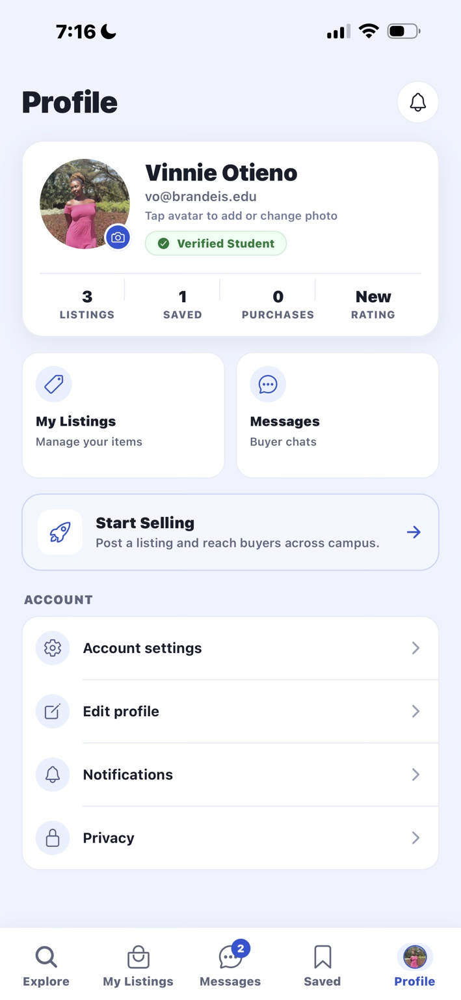

# UniMarket

A mobile-first campus marketplace where students can list items, discover local deals, and coordinate transactions through listing-bound messaging.

This repository contains:
- `project/unimarketFrontend`: Expo + React Native client (Expo Router)
- `project/unimarketBackend`: Node.js + Express + MongoDB API with Socket.IO realtime messaging

## Table of Contents
- [Overview](#overview)
- [Core Features](#core-features)
- [App Navigation](#app-navigation)
- [Screen Walkthrough](#screen-walkthrough)
- [Tech Stack](#tech-stack)
- [Repository Structure](#repository-structure)
- [Getting Started](#getting-started)
- [Environment Variables](#environment-variables)
- [Running the App](#running-the-app)
- [API Reference](#api-reference)
- [Realtime Events (Socket.IO)](#realtime-events-socketio)
- [Data Model](#data-model)
- [Authentication Notes](#authentication-notes)
- [Scripts](#scripts)
- [Troubleshooting](#troubleshooting)
- [Roadmap Suggestions](#roadmap-suggestions)
- [Contributing](#contributing)
- [License](#license)

## Overview
UniMarket is designed for campus buying/selling workflows:
- browse active listings
- create listings with required photos and optional video
- message sellers directly from listing context
- mark listings pending/sold and reflect status in conversations

The backend serves both REST APIs and realtime events for a responsive messaging experience.

## Core Features

### Marketplace
- Create, read, update, soft-delete listings
- Listing media upload (`image/*` + `video/*`, max 40 MB per file)
- Required at least one image when creating a listing
- Listing statuses: `available`, `pending`, `sold`, `deleted`
- Prevent users from buying their own listing

### Messaging
- Conversation identity constrained by `(listingId, buyerEmail, sellerEmail)`
- Reopens existing thread instead of creating duplicates
- Inbox with unread counts and listing context
- Message send + mark-as-read flow
- Seller actions: mark listing pending/sold in-thread
- Realtime updates with Socket.IO:
  - new messages
  - inbox refresh triggers
  - listing status sync

### Mobile UX
- Branded landing + auth flow
- Tab architecture: Explore, My Listings, Messages, Saved, Profile
- Listing detail modal with image carousel and seller actions
- Theming system (`src/theme/colors.ts`) used across app surfaces

### Routing / Entry Point
- Frontend runtime entry is `expo-router/entry` (see `project/unimarketFrontend/package.json`).
- The active route tree lives under `project/unimarketFrontend/app`.

## App Navigation
UniMarket uses a mobile-first navigation model with a clear handoff from onboarding into persistent tab-based browsing.

<p align="center">
  <strong>Landing</strong> &rarr; <strong>Create Account</strong> &rarr; <strong>Explore</strong> &rarr; <strong>Saved</strong> / <strong>My Listings</strong> / <strong>Messages</strong> / <strong>Profile</strong>
</p>

Navigation intent:
- Explore is the default post-auth home for search, category browsing, and saving items.
- Saved is a dedicated revisit surface for favorited listings.
- My Listings and Profile support the seller/account side of the product without interrupting browsing.
- Messages stays globally accessible from the bottom tab bar during buyer and seller workflows.

## Screen Walkthrough

### 1. Join the marketplace
<table>
  <tr>
    <td align="center">
      
      <br />
      <strong>Landing</strong>
      <br />
      Brand entry point.
    </td>
    <td align="center">
      
      <br />
      <strong>Create Account</strong>
      <br />
      Student onboarding.
    </td>
  </tr>
</table>

<p align="center"><strong>Entry Flow:</strong> Landing &rarr; Create Account &rarr; Explore</p>

### 2. Browse and save
<table>
  <tr>
    <td align="center">
      
      <br />
      <strong>Explore</strong>
      <br />
      Browse and discover.
    </td>
    <td align="center">
      
      <br />
      <strong>Saved</strong>
      <br />
      Revisit favorites.
    </td>
  </tr>
</table>

<p align="center"><strong>Discovery Flow:</strong> Explore &rarr; Save for later &rarr; Message or purchase from listing context</p>

### 3. Manage activity
<table>
  <tr>
    <td align="center">
      
      <br />
      <strong>My Listings</strong>
      <br />
      Seller workspace.
    </td>
    <td align="center">
      
      <br />
      <strong>Profile</strong>
      <br />
      Account hub.
    </td>
  </tr>
</table>

<p align="center"><strong>Management Flow:</strong> My Listings &rarr; Profile &rarr; account actions, seller tools, and message access</p>

Messages remains part of the persistent bottom navigation even though it is not shown here.

## Tech Stack

### Frontend (`project/unimarketFrontend`)
- Expo SDK 54
- React Native 0.81
- Expo Router
- TypeScript
- AsyncStorage (local auth/account persistence)
- Socket.IO client
- Expo Image Picker + Location
- Expo Notifications

### Backend (`project/unimarketBackend`)
- Node.js + Express
- MongoDB + Mongoose
- Socket.IO
- Multer (media uploads)
- CORS + dotenv

## Repository Structure
```text
.
├── docs
│   └── images
│       └── navigation
├── README.md
└── project
    ├── unimarketBackend
    │   ├── src
    │   │   ├── config
    │   │   ├── controllers
    │   │   ├── middleware
    │   │   ├── models
    │   │   ├── routes
    │   │   ├── services
    │   │   ├── utils
    │   │   └── index.js
    │   └── scripts
    └── unimarketFrontend
        ├── app
        │   ├── (auth)
        │   ├── (tabs)
        │   └── (modals)
        ├── src
        │   ├── components
        │   ├── contexts
        │   ├── hooks
        │   ├── services
        │   ├── theme
        │   └── types.ts
        └── app.json
```

## Getting Started

### Prerequisites
- Node.js 18+
- npm 9+
- MongoDB instance (Atlas or local)
- Expo Go or iOS/Android simulator for general UI testing
- Development build for push-notification testing

### 1) Install dependencies
```bash
cd project/unimarketBackend && npm install
cd ../unimarketFrontend && npm install
```

### 2) Configure environment
Create backend env file:

`project/unimarketBackend/.env`
```env
PORT=5001
MONGO_URI=<your_mongodb_connection_string>
```

Optional frontend override for API base URL:

`project/unimarketFrontend/.env` (or shell env)
```env
EXPO_PUBLIC_API_BASE_URL=http://<your-machine-ip>:5001
```

## Environment Variables

### Backend
- `PORT` (required): API server port
- `MONGO_URI` (required): MongoDB connection string

### Frontend
- `EXPO_PUBLIC_API_BASE_URL` (optional): Explicit API URL override.
  - If not set, frontend resolves host from Expo dev host with platform fallbacks.

## Running the App

### Start backend
```bash
cd project/unimarketBackend
npm run dev
```

### Start frontend
```bash
cd project/unimarketFrontend
npm start
```

Then launch with:
- `i` for iOS simulator
- `a` for Android emulator
- Expo Go by scanning QR for standard UI flows

For push notifications, use a development build instead of Expo Go.

## API Reference
Base URL: `http://<host>:5001`

### Health
- `GET /` → `"API is running"`

### Users
- `POST /api/users`
  - Body:
    ```json
    { "name": "Jane Doe", "email": "jane@school.edu" }
    ```
  - Behavior: create or update by normalized email

### Listings
- `GET /api/listings`
  - Returns listings with status `available` or `pending`
- `GET /api/listings/user/:email`
  - Returns listings for user where status != `deleted`
- `GET /api/listings/:id`
- `POST /api/listings`
  - Required: `title`, `description`, `price`, `userEmail`
  - Requires at least one image via `imageUrl` or `media[]`
- `POST /api/listings/upload`
  - Multipart form-data with field `media`
  - Returns uploaded `url` and inferred media `type`
- `POST /api/listings/:id/purchase`
  - Body: `{ "buyerEmail": "..." }`
  - Prevents self-purchase
- `POST /api/listings/:id/mark-pending`
  - Body: `{ "userEmail": "seller@..." }`
- `POST /api/listings/:id/mark-sold`
  - Body: `{ "userEmail": "seller@..." }`
- `PUT /api/listings/:id`
- `DELETE /api/listings/:id`
  - Soft-delete by setting status to `deleted`

### Conversations & Messages
- `GET /api/conversations?userEmail=...`
- `POST /api/conversations`
  - Body: `{ "listingId": "...", "buyerEmail": "..." }`
  - Creates or reopens listing-bound conversation
- `GET /api/conversations/:id?userEmail=...`
- `GET /api/conversations/:id/messages?userEmail=...`
- `POST /api/conversations/:id/messages`
  - Body: `{ "senderEmail": "...", "body": "..." }`
- `POST /api/conversations/:id/read`
  - Body: `{ "userEmail": "..." }`

## Realtime Events (Socket.IO)
Server URL: same host/port as REST API

### Client emits
- `join-user` with normalized email
- `join-conversation` with conversation id
- `leave-conversation` with conversation id

### Server emits
- `message:new` (to `conversation:<id>` room)
- `inbox:refresh` (to `user:<email>` room)
- `listing:status` (broadcast)
- `conversation:read` (to conversation room)

## Data Model

### `User`
- `name` (string, required)
- `email` (string, required, unique)

### `Listing`
- `title`, `description`, `price`, `category`, `userEmail`
- `imageUrl` (primary image)
- `media[]` with `{ type: image|video, url }`
- `status`: `available|pending|sold|deleted`

### `Conversation`
- `listingId` (ref Listing)
- `buyerEmail`, `sellerEmail`
- `lastMessage`, `lastMessageAt`
- unread counters per role
- `status`: `active|archived|blocked|closed`
- `listingSnapshot` (title/price/thumbnail/status)
- Unique index: `(listingId, buyerEmail, sellerEmail)`

### `Message`
- `conversationId` (ref Conversation)
- `senderEmail`, `body`
- `sentAt`, `readAt`
- `deliveryStatus`: `sent|delivered`

## Authentication Notes
Current auth is client-side account persistence (AsyncStorage):
- sign-up validates `.edu` email format
- accounts are stored locally on device
- backend user endpoint is used as best-effort profile sync

This is suitable for rapid prototyping, not production security.
For production, replace with server-validated auth (e.g., JWT/session/OAuth).

## Scripts

### Backend
```bash
npm run dev   # nodemon src/index.js
npm start     # node src/index.js
```

### Frontend
```bash
npm start     # expo start
npm run ios   # expo start --ios
npm run android # expo start --android
npm run web   # expo start --web
```

## Troubleshooting

### `Port 5001 is already in use`
- Another backend instance is running.
- Stop existing process or change `PORT` in backend `.env`.

### Mobile shows `Network request failed`
- Ensure backend is running and reachable from your device.
- Set `EXPO_PUBLIC_API_BASE_URL` to your machine LAN IP (not `localhost`) when using a physical device.

### Uploaded media not rendering
- Confirm the returned `/api/media/:id` URL is reachable from the device or simulator.
- Re-check file type and size limits in `uploadMiddleware`.

### Messages not updating live
- Verify Socket.IO connection to backend URL.
- Ensure user emits `join-user` and conversation emits `join-conversation`.

## Roadmap Suggestions
- Replace local auth with secure server-side authentication
- Add authorization middleware on protected routes
- Add automated tests (unit/integration/E2E)
- Add pagination and search/filter endpoints for listings and messages
- Add CI for lint/typecheck/test

## Contributing
1. Create a feature branch.
2. Keep changes scoped and include validation steps.
3. Open a PR with:
   - summary
   - screenshots (frontend changes)
   - test/verification notes

## License
No license file is currently present in this repository.
